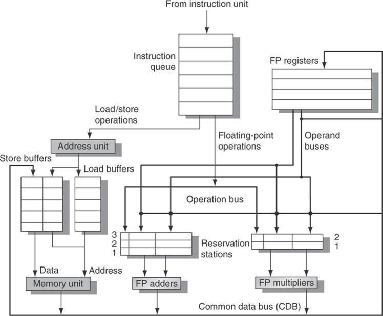

# Tomasulo algorithm
* simulate out of order execution by Tomasulo algorithm



## Terminology
Reservation Station (RS)
Function Unit (FU)
Common Data Bus (CDB)

## Fields of Reservation Station (RS)
* ```op```: Operation to perform in the unit
* ```Vj, Vk```: Values of Source operands
* ```Qj, Qk```: RS producing source registers (value to be written)
* ```busy```: indicates RS or FU is busy
* ```A```: memory address
---
* ```Qi```: register result status

## Steps
### issue/dispatch
* Get the next instruction from the head of the instruction queue, which is maintained in FIFO order to ensure the maintenance of correct data flow.
	* If there is no empty RS (structural hazard), the instruction stalls until a station or buffer is freed.
	* If there is a matching RS that is empty,
		* if the operands are currently in the registers, issue the instruction to the station with the operand values,
		* If the operands are not in the registers, keep track of the functional units that will produce the operands. This step renames registers, eliminating WAR and WAW hazards.
### execute
* If one or more of the operands is not yet available, monitor the CDB while waiting for it to be computed. When an operand becomes available, it is placed into any RS awaiting it.
* When all the operands are available, the operation can be executed at the corresponding functional unit.
* By delaying instruction execution until the operands are available, RAW hazards are avoided.
* Loads and stores require a two-step execution process
	a) Compute the effective address when the base register is available
	b) Effective address is then placed in the load or store buffer
* To preserve exception behavior, no instruction is allowed to initiate execution until all branches that precede the instruction in program order have completed.
### write result
* When the result is available, write it on the CDB and from there into the registers and into any RS waiting for this result.

# Reference
* [ResearchGate - Tomasulo](https://www.researchgate.net/figure/1-The-basic-structure-of-a-MIPS-floating-point-unit-using-Tomasulos-algorithm_fig1_318502489)
